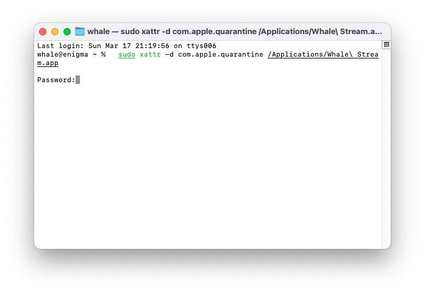

<p align="center">
  
</p>
<p align="center">
  </a>
  <!-- TypeScript Badge -->
  

  <a href="https://github.com/yetone/openai-translator/releases" target="_blank">
    
  </a>

  <a href="https://github.com/yetone/openai-translator/releases" target="_blank">
    
  </a>

  <a href="https://github.com/yetone/openai-translator/releases" target="_blank">
    
  </a>
</p>

# Chuẩn bị

- Đảm bảo kết nối mạng ổn định, máy tính và 1 chỗ để ngồi (nằm).

# Cài đặt

## Windows

### Cài đặt thủ công

1. Tải gói cài đặt đuôi `.exe` từ trang [Latest Release](https://github.com/dungxtd/whalestream/releases).
2. Nhấp đúp vào tệp đã tải để cài đặt.
3. Nếu được nhắc là không an toàn, nhấp vào `More Info` -> `Run Anyway` để tiếp tục cài đặt.
4. Khởi động `Whale Stream`.

## MacOS

### Cài đặt thủ công

1. Truy cập trang [Latest Release](https://github.com/dungxtd/whalestream/releases) và tải gói cài đặt đuôi `.dmg` tương ứng với <b>chip</b> của bạn. Lưu ý: Sử dụng phiên bản <b>AArch64 (ARM64)</b> cho các máy Apple Silicon và chạy lệnh `xattr` ở dưới.
2. Nhấp đúp vào tệp đã tải để cài đặt.
3. It's been a long time coming but khởi động `Whale Stream`.

### Sửa lỗi

#### Nhận thông báo lỗi <b>Tệp bị hỏng</b> với các máy Apple Silicon.

1. Mở `Terminal.app` và nhập lệnh phía dưới rồi nhận Enter.
2. Nếu có yêu cầu mật khẩu, nhập mật khẩu đăng nhập máy tính của bạn (khi nhập sẽ chỉ hiện khoảng trắng, không hiện mật khẩu) rồi tiếp tục nhấn Enter.
3. Khởi động lại `Whale Stream`:

```sh
  sudo xattr -cr /Applications/Whale\ Stream.app
```

   
   
# License
