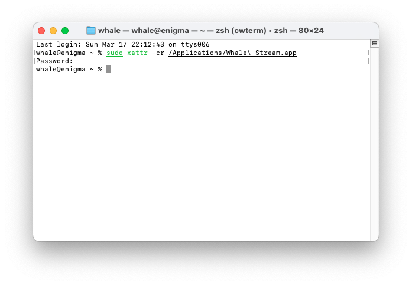

<p align="center">
  
</p>
<p align="center">
  </a>
  <!-- TypeScript Badge -->
  

  <a href="https://github.com/yetone/openai-translator/releases" target="_blank">
    
  </a>

  <a href="https://github.com/yetone/openai-translator/releases" target="_blank">
    
  </a>

  <a href="https://github.com/yetone/openai-translator/releases" target="_blank">
    
  </a>
</p>

# Chuẩn bị

- Đảm bảo kết nối mạng ổn định, máy tính và hehe.

# Cài đặt

## Windows

### Cài đặt thủ công

1. Tải gói cài đặt đuôi `.exe` từ trang [Latest Release](https://github.com/dungxtd/whalestream/releases).
2. Nhấp đúp vào tệp đã tải để cài đặt.
3. Nếu được nhắc là không an toàn, nhấp vào `More Info` -> `Run Anyway` để tiếp tục cài đặt.
4. Readyyyyy!

## MacOS

### Cài đặt thủ công

1. Truy cập trang [Latest Release](https://github.com/dungxtd/whalestream/releases) và tải gói cài đặt đuôi `.dmg` tương ứng với <b>chip</b> của bạn. Lưu ý: Sử dụng phiên bản aarch64 cho các máy Apple Silicon và chạy lệnh `xattr` ở dưới.
2. Nhấp đúp vào tệp đã tải để cài đặt.
3. It's been a long long time coming buttttt.

### Sửa lỗi

- Nhận thông báo lỗi như tệp bị hỏng với các máy Apple Silicon. Mở `Terminal.app` và nhập lệnh sau (bạn có thể cần nhập mật khẩu giữa chừng), sau đó khởi động lại `Whale Stream`:

```sh
  sudo xattr -cr /Applications/Whale\ Stream.app
```

   
   
# License
