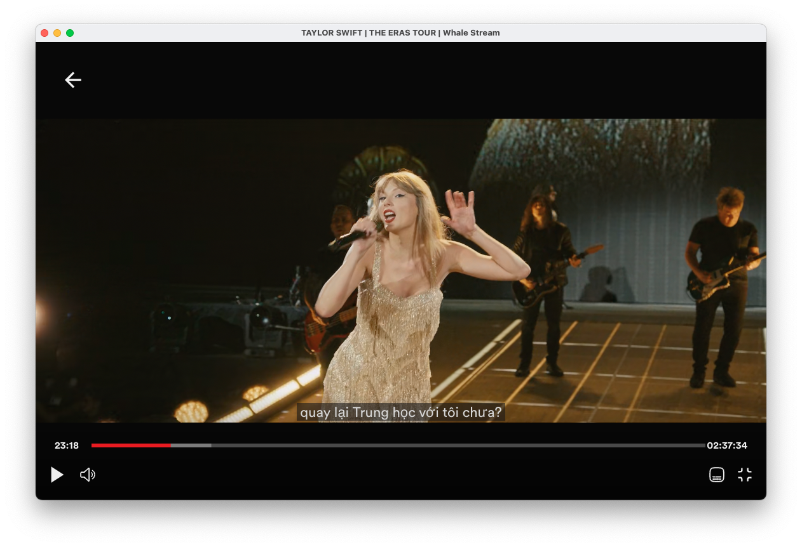

<p align="center">
    <em>Whale Stream allows users to stream films directly on their desktop.</em>
</p>

<p align="center">
  </a>
  <!-- TypeScript Badge -->
  

  <a href="https://github.com/yetone/openai-translator/releases" target="_blank">
    
  </a>

  <a href="https://github.com/yetone/openai-translator/releases" target="_blank">
    
  </a>

  <a href="https://github.com/yetone/openai-translator/releases" target="_blank">
    
  </a>
</p>

# Why Yet another application

As a passionate movie buff, I understand the joy and excitement of diving into a captivating film. However, the hassle of switching between different streaming services or dealing with platform restrictions can sometimes dampen the experience. That's why I developed the Whale Stream.

# More than application

What began as a Mac application has now evolved into a multi-platform desktop app that I am currently developing.

<p align="center">
  
</p>

# Features

1. Explore Movies by Themes: Browse through a menu of curated movie themes and genres, making it easy to discover new films based on your interests.
   
2. Overview: Access detailed information and summaries for each movie, including cast, plot synopsis, ratings, and reviews, helping you make informed decisions about what to watch.
   
3. Movie Search: Search functionality to quickly find specific films by title or keywords, ensuring you can locate your desired content effortlessly.
4. Automatic Subtitle Detection: Whale Stream automatically searches for and applies subtitles to movies, providing a seamless viewing experience for users.
   
5. Similar Movie Recommendations: Receive personalized recommendations for similar movies based on your viewing history and preferences, allowing you to explore related content and broaden your cinematic horizons.

# Preparation

- Ensure stable network connection, laptop, and enjoy the movie.

# Installation

## Windows

### Install Manually

1. Download the installation package ending in `.exe` from the [Latest Release](https://github.com/dungxtd/whalestream/releases) page.
2. Double click the downloaded file to install it.
3. Ready to use!

## MacOS

### Install Manually

1. Go to the [Latest Release](https://github.com/dungxtd/whalestream/releases) page and download the corresponding chip's `.dmg` installation package. Note: Use aarch64 version for Apple Silicon machines and run `xattr` command below.
2. Double click the downloaded file to install it.
3. If prompted as unsafe, you can click on `More Info` -> `Run Anyway` to proceed with the installation.
4. Ready to use!

### Troubleshooting

- Whale Stream can’t be opened because the developer cannot be verified.

  - Get error prompts such as broken files with Apple Silicon machines. Open `Terminal.app` and enter the following command (you may need to enter a password halfway through), then restart `Whale Stream`:

    ```sh
    sudo xattr -d com.apple.quarantine /Applications/Whale\ Stream.app
    ```

# License

<!-- [LICENSE](./LICENSE) -->
